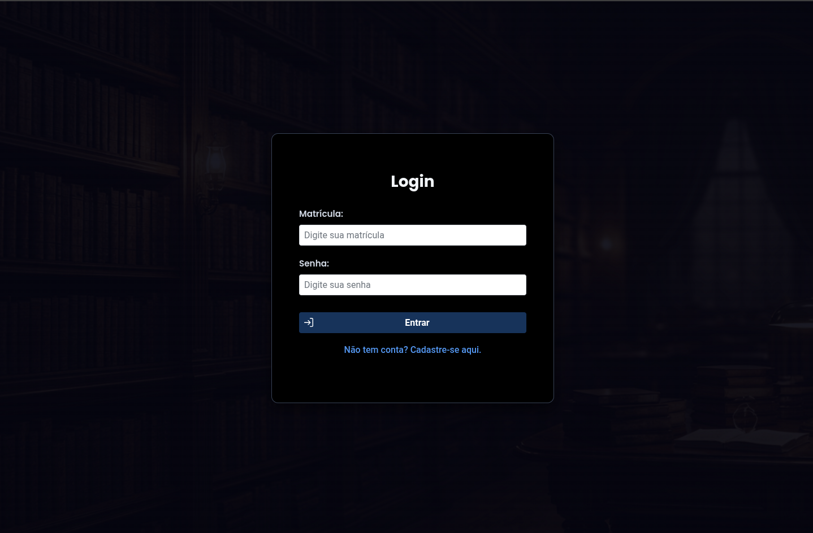
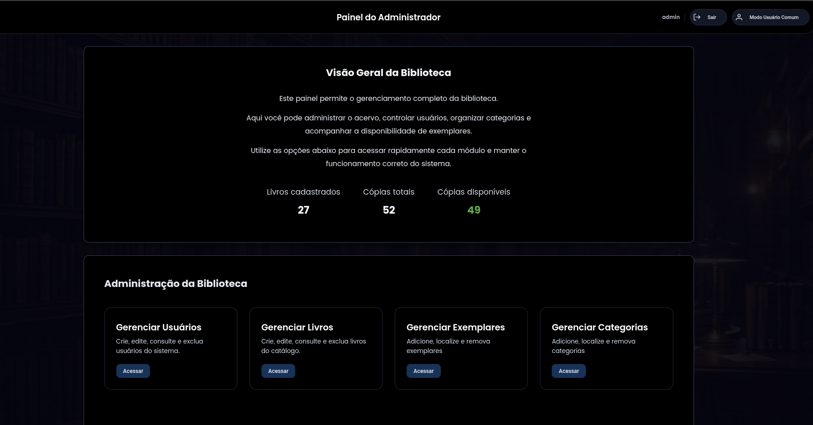
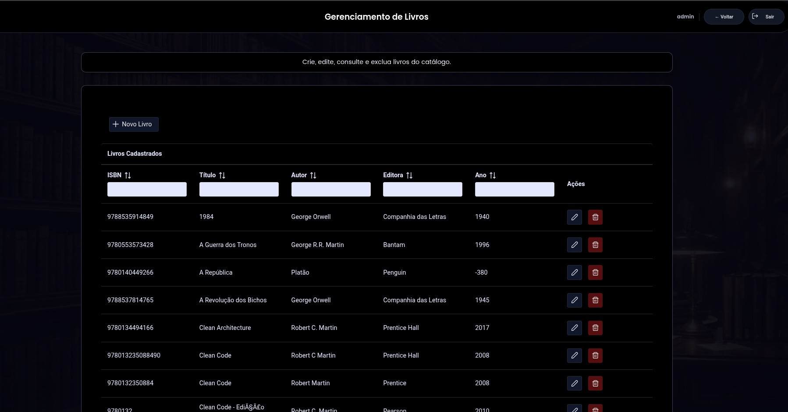
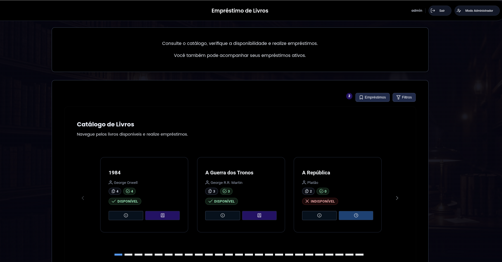
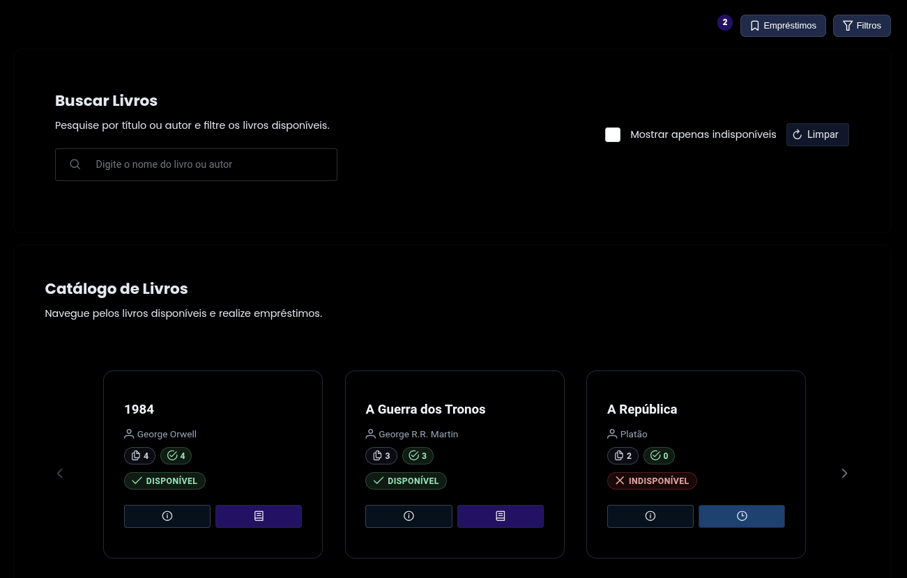
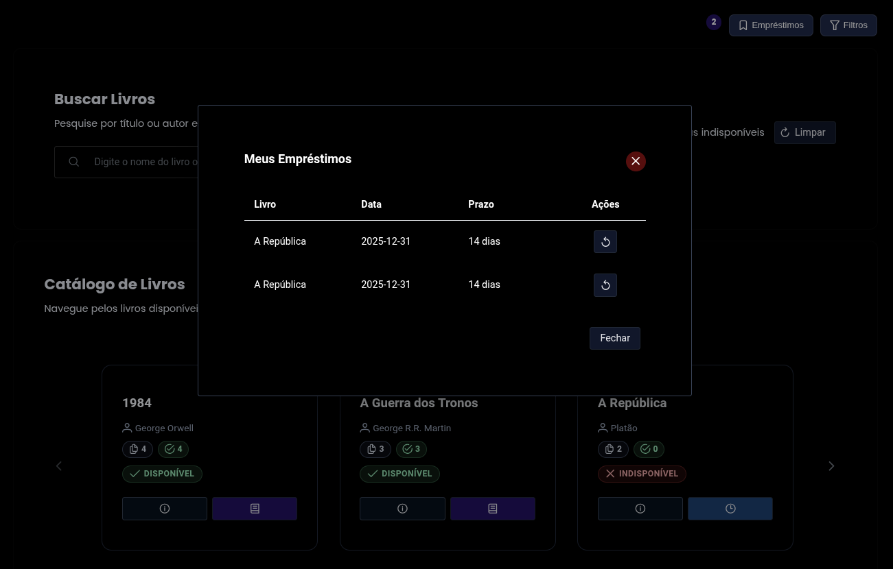
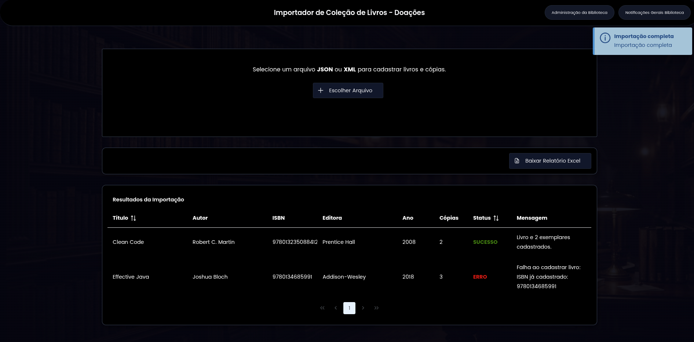
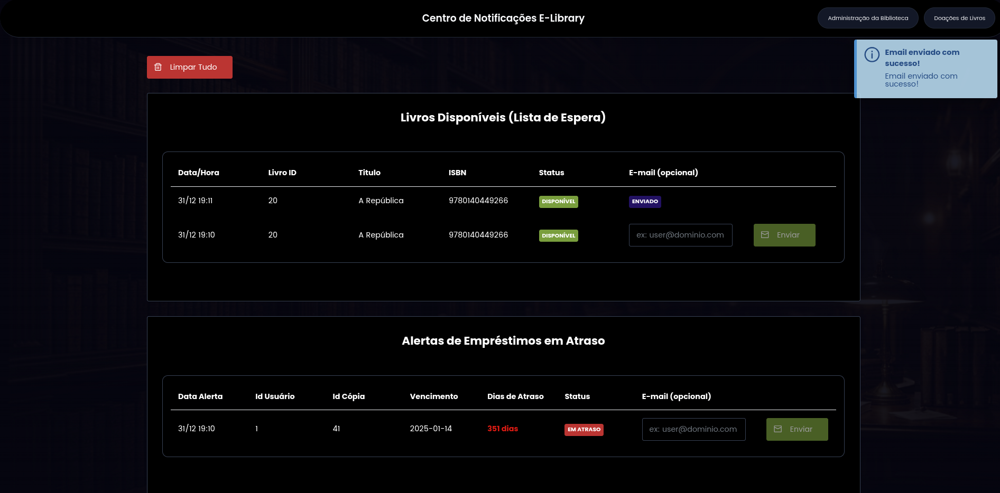

# 📚 E-Library — Ecossistema de Gestão de Biblioteca Distribuída

> **Projeto Académico para a disciplina de Serviços de Suporte a Aplicações Distribuídas (SSAD)** > Arquitetura Híbrida: **Jakarta EE 10 (WildFly 31)** + **Spring Boot 3 (GraphQL)** + **JMS Assíncrono**

<p align="center">
  
</p>

---

## 📑 Índice de Documentação Detalhada

Para facilitar a compreensão técnica de cada camada, a documentação foi dividida em módulos específicos:

- [🏗️ **Arquitetura e Contratos (Core & Client)**](docs/ARCHITECTURE.md) - Justificativa de DTOs, EJBs e separação de responsabilidades.

- [🌐 **Módulo Web (JSF)**](docs/WEB.md) - Interface administrativa,fluxos de negócio.

- [💻 **Cliente Java SE**](docs/SE.md) - Acesso remoto via JNDI/RMI, simulação de terminal de balcão.

- [📡 **API RESTful**](docs/API.md) - Camada de exposição JAX-RS, orquestração de EJBs, validações e status.

- [📊 **Gateway GraphQL (Spring)**](docs/GRAPHQL.md) - Camada de agregação moderna (BFF), consultas flexíveis e otimizadas.

- [📦 **Importação de Dados (XML/JSON)**](docs/IMPORT.md) - Processamento de doações, validação de ISBN e criação de exemplares.

- [📬 **Mensageria Assíncrona (JMS)**](docs/MESSAGE_NOTIFICATION.md) - Notificações de disponibilidade e atrasos, consumidor assíncrono e histórico.

- [📧 **Envio de E-mails**](docs/EMAIL.md) - Integração com Jakarta Mail para notificações.
---

## 🖼️ Demonstração Visual das Interfaces

> *Todas as interfaces foram desenvolvidas com JSF 3.0 e PrimeFaces 12.*

### 🏢 Administração (E-LibraryWeb)

#### Entrada




#### Parte Administrativa





#### Interação do usuário 







----

### 📥 Importação de Doações (E-LibraryImportWeb)



### 📬 Centro de Notificações (E-LibraryNotificationConsumer)



## 📌 Visão Geral

O **E-Library** é um sistema distribuído robusto que demonstra a integração entre o ecossistema corporativo clássico **(Jakarta EE)** e padrões modernos de consumo de dados **(GraphQL, mensageria)**. O sistema gere livros, exemplares, utilizadores e empréstimos, garantindo a integridade dos dados através de transações distribuídas e alta performance via cache em memória.

O sistema opera através de um **Enterprise Archive (EAR)** central, que é o ponto único de verdade, consumido por múltiplas frentes.

### 📂 Organização do Projeto (Maven Multi-Module)

O projeto está estruturado sob um **POM Pai** que gere o ciclo de vida de todos os módulos, garantindo que a biblioteca de contratos (`Client`) seja compilada antes dos consumidores.

Os módulos abaixo são empacotados juntos para deploy no WildFly:

#### 🏢 EAR — Enterprise Archive (dentro do WildFly)

  - **`E-Library` (PAI):** Contém o `pom.xml` raiz que coordena as versões e a ordem de build.
    - Empacotado e implantado como um único **.ear**, contém toda a **lógica de negócio**, **persistência** e **contratos públicos**. É o coração transacional do sistema, com acesso local entre seus módulos:

      1. **`E-LibraryClient`**: define o contrato público do sistema — interfaces remotas (`@Remote`), DTOs, enums e exceções customizadas. Comunicação dos módulos, tanto internos quanto externos passam por aqui.

      2. **`E-LibraryCore`**: contém a lógica de negócio real — entidades JPA, Session Beans (`@Stateless`, `@Stateful`, `@Singleton`) e regras de domínio (validação de ISBN, controle de status de exemplares, gestão de empréstimos e lista de espera). É acessado localmente pelos demais módulos do EAR.

      3. **`E-LibraryEvents`**: biblioteca de eventos padronizados (ex:`BookAvailabilityEvent`, `LoanOverdueEvent`), usada como *linguagem comum* entre o Core (que publica mensagens via JMS) e o Consumer (que as consome). Faz parte do EAR, mas também é compartilhada com o `E-LibraryNotificationConsumer`.

      4. **`E-LibraryWeb`**: interface administrativa baseada em JSF e PrimeFaces. Utiliza *Managed Beans* que injetam os EJBs do Core via `@EJB` (acesso **local**), permitindo operações como cadastro de livros, empréstimos e gerenciamento de usuários.

      5. **`E-LibraryAPI`**: camada de exposição REST (JAX-RS), que orquestra os EJBs do Core e os expõe como endpoints HTTP (JSON). Funciona como fachada síncrona para integração externa. Todo acesso remoto ao domínio passa por aqui — exceto para o cliente SE, que usa JNDI diretamente.

      6. **`E-LibraryEAR`:** O projeto de empacotamento que gera o ficheiro `.ear` final contendo todos os módulos acima.

#### 🌐 Aplicações Externas (fora do EAR)

  - São projetos independentes, sem acesso direto às classes internas do EAR — apenas ao contrato (`E-LibraryClient.jar`) ou à API REST:

    1. **`E-LibrarySE`**: aplicação Java SE (console) que simula um terminal de balcão. Consome diretamente os EJBs do Core via **JNDI/RMI**, usando as interfaces `@Remote` definidas em `E-LibraryClient`. 
        - É o único cliente que acessa o EAR por meio de chamadas remotas clássicas.

    2. **`E-LibraryGraph`**: gateway GraphQL construído com Spring Boot 3. 
        -  Não implementa lógica de negócio: todas as *resolvers* delegam chamadas à **`E-LibraryAPI`** (REST/JSON), usando-a como ponte para o EAR. 
        -  Isso permite consultas flexíveis (ex: dashboard com dados agregados) sem sobrecarregar o frontend.
        - * **Papel Estratégico:** Este módulo **não substitui** a API existente. Ele **agrega** valor, servindo como uma camada de orquestração que unifica diversos serviços REST num único endpoint GraphQL, otimizando a experiência do front-end e evitando tráfego desnecessário de dados (*overfetching*).

    3. **`E-LibraryImportWeb`**: aplicação web JSF/PrimeFaces dedicada à importação de doações (arquivos XML/JSON). 
        - Contém formulário de upload e processamento em lote. 
        - Ao invés de acessar os EJBs diretamente, comunica-se com o EAR exclusivamente via **chamadas HTTP à `E-LibraryAPI`**, garantindo reuso de validações e transações.

    4. **`E-LibraryNotificationConsumer`**: serviço assíncrono que consome mensagens JMS publicadas pelo Core. Contém:
        - Um **Message-Driven Bean (MDB)** que desserializa eventos do pacote `E-LibraryEvents` e registra notificações no banco;
        - Uma interface **JSF/PrimeFaces** para visualização do histórico de notificações (disponibilidade, atrasos).
          - **A mensageria é totalmente desacoplada:** o Core publica mensagens *após o commit da transação principal*; o Consumer apenas reage — nunca interfere na lógica de negócio.
---

## ⚙️ Setup e Deploy

### 📥 Pré-requisitos
* **Java 21+**
* **WildFly 31.0.1.Final**
* **PostgreSQL 14+**

---

### 🔧 Passo 1: Configurar o WildFly

1. Execute:
   ```bash
   cd wildfly-31.0.1.Final/bin
   ./add-user.sh 
   ```

2. Crie usuário Management:
  - Username: ssad
  - Password: ssad
  - Confirme tudo com yes.

- Acesse http://localhost:9990 para confirmar.

---

### 🗃️ Passo 2: Criar o Banco (PostgreSQL)

- Crie via linha de comando:
  ```bash
  CREATE USER aluno WITH PASSWORD 'aluno';
  CREATE DATABASE elibrary OWNER elibrary ENCODING 'UTF8';
  \c elibrary
  \i elibrary_dump.sql # para popular com dados
  ```
  - Ou pela interface no `pgadmin`

---

### 🔌 Passo 3: Configurar o DataSource E-LibraryCoreDS

#### Instale o driver PostgreSQL no WildFly
  1. Entrando na interface por: http://localhost:9990, faça login com o usuário criado antes
  2. Vá em `Deployments` opção `+` e `upload deployment` e selecione o arquivo `.jar` do driver do postgres

#### DashSource 
  1. Vá em `Subsystems > Datasources & Driver > Datasources` e `add Datasource`:
  2. Crie o DataSource:
      - **Name:** `E-LibraryCoreDS`
      - **JNDI Name:** `java:/E-LibraryCoreDS`
      - **Driver:** `postgresql` # criado antes
      - **Connection URL:** `jdbc:postgresql://localhost:5432/elibrary`
      - **Username/Password:** `aluno` / `aluno`
      - Clique em `Test Connection ✅`
---

### 📬 Passo 4: Configurar as Filas JMS no WildFly

A mensageria assíncrona (notificações de disponibilidade e atrasos) depende de filas JMS pré-configuradas no WildFly. Certifique-se de que o servidor está rodando com o perfil **standalone-full.xml**, que inclui suporte completo a JMS (o perfil padrão **standalone**.xml não possui esse subsistema habilitado).

1. Inicie o WildFly com o perfil completo:

```bash
cd wildfly-31.0.1.Final/bin
./standalone.sh -c standalone-full.xml
# (ou standalone.bat no Windows)
```

2. Acesse o console de administração:

    - http://localhost:9990
        - Faça login com o usuário ssad / ssad.

3. Navegue até:
    - Subsystems → Messaging → Server → default → Destinations → View.

4. Na aba JMS Queues:
  - Clique em Add.
  - Preencha os campos:
    - Name: LibraryNotificationQueue
    - Entries: java:/jms/queue/libraryNotificationQueue
    - Selectors: deixe vazio

  - Clique em Save.

✅ A fila será criada e estará pronta para uso pelo Core `(@Resource(lookup = "java:/jms/queue/libraryNotificationQueue"))` e pelo Consumer `(MDB com @ActivationConfigProperty(propertyName = "destinationLookup", value = "java:/jms/queue/libraryNotificationQueue"))`.

> ⚠️ Importante: Se você implantar o E-LibraryNotificationConsumer como parte de outro EAR ou WAR, ele também precisa ser deployado no mesmo WildFly com perfil standalone-full.xml.

### 🚀 Passo 5: Build e Deploy do EAR

Na raiz do projeto pai:

```bash
mvn clean install
```
- Faça o mesmo em cada projeto em sequência. 
- Por ultimo o EAR onde vai criar o arquivo `e-library.ear`
- Copie para a pasta de `deploy` do wildfly

```bash
cp ear/target/e-library.ear $WILDFLY_HOME/standalone/deployments/
```

## 📁 Recursos do Projeto

| Recurso | Arquivo/Localização | Descrição |
|---------|---------------------|-----------|
| 📄 **Relatório técnico** | [`relatorio-tecnico.pdf`](relatorio_tecnico.pdf) | Justificativa do uso de `@Singleton`, `@Stateful` e `@Stateless`. |
| 💾 **Backup do banco** | [`elibrary_dump.sql`](elibrary_dump.sql) | Script de criação e *seed* do banco PostgreSQL (com usuários, livros, exemplares e empréstimos de exemplo). |

