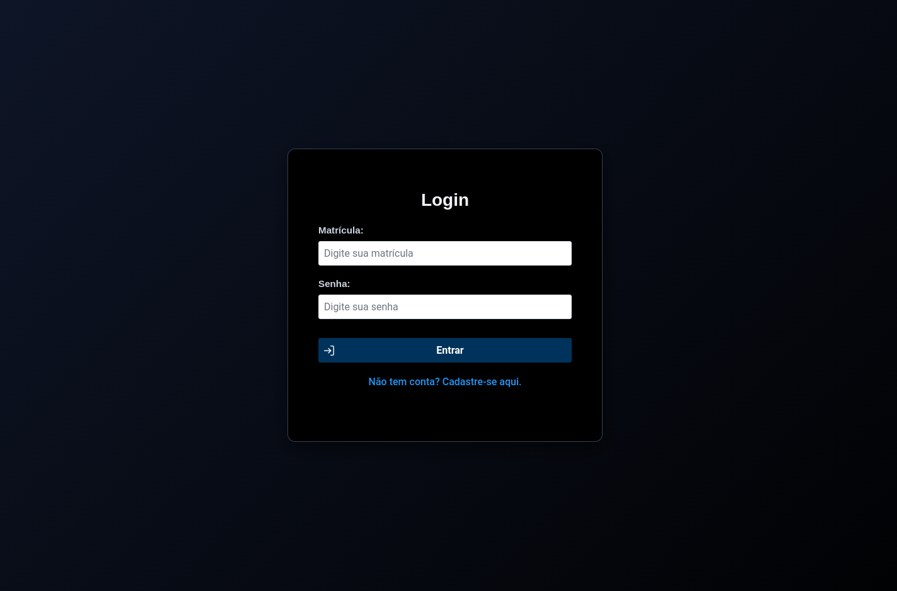
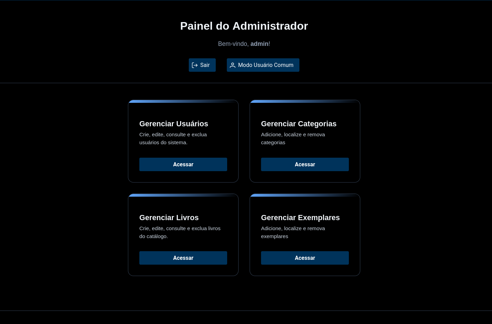
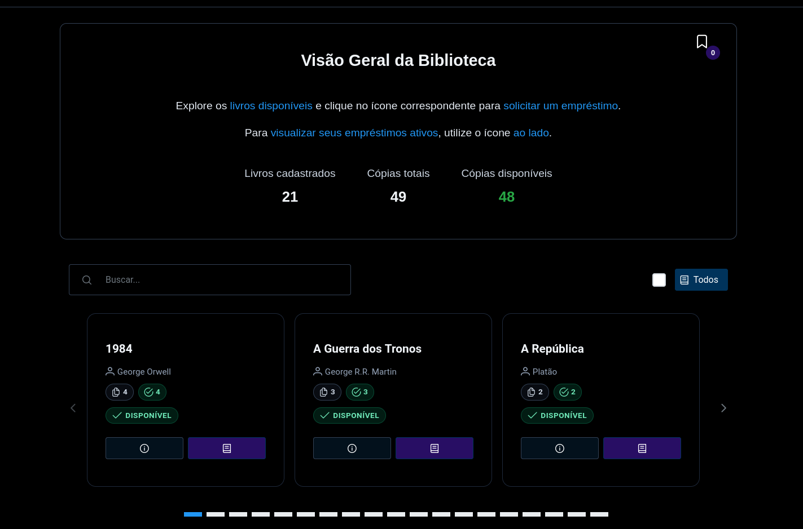

# 📚 E-Library — Sistema de Gerenciamento de Biblioteca Distribuída

> **Projeto acadêmico para a disciplina de Serviços de Suporte a Aplicações Distribuídas (SSAD)**  
> Arquitetura Jakarta EE 9+ com **EJB 4.0**, **JPA 3.1**, **JSF 3.0** e **WildFly 31+**




---

## 📑 Índice

- [📌 Visão Geral da Arquitetura](#-visão-geral-da-arquitetura)
- [🧩 Estrutura do Projeto EAR](#-estrutura-do-projeto-ear)
- [📦 Módulo `e-library-client` — Contrato Compartilhado](#-módulo-e-library-client----contrato-compartilhado)
- [🧠 Camada de Mapeamento — Entity ↔ DTO](#-camada-de-mapeamento----entity--dto)
- [🗃️ Modelagem de Persistência](#-modelagem-de-persistência)
- [🧩 EJB Session Beans](#-ejb-session-beans)
  - [`CatalogStatusSB` — Singleton](#-catalogstatussb----singleton)
  - [`UserSessionSB` — Stateful](#-usersessionsb----stateful)
  - [`BookSB`, `CopySB`, etc. — Stateless](#-booksb-copysb-etc----stateless)
- [📦 Empacotamento EAR](#-empacotamento-ear)
- [🌐 Módulo Web — JSF + PrimeFaces](#-módulo-web----jsf--primefaces)
  - [Conversão (`BookConverter`)](#-conversão-bookconverter)
  - [Controle de Acesso (Filtros)](#-controle-de-acesso-filtros)
  - [Managed Beans](#-managed-beans)
- [💻 Cliente Java SE Remoto](#-cliente-java-se-remoto)
- [⚙️ Como Executar Localmente](#️-como-executar-localmente)
  - [📥 Pré-requisitos](#-pré-requisitos)
  - [🔧 Passo 1: Configurar o WildFly](#-passo-1-configurar-o-wildfly)
  - [🗃️ Passo 2: Criar o Banco de Dados (Postgres)](#-passo-2-criar-o-banco-de-dados-postgres)
  - [🔌 Passo 3: Configurar o DataSource `E-LibraryDS`](#-passo-3-configurar-o-datasource-e-libraryds)
  - [🚀 Passo 4: Deploy do EAR](#-passo-4-deploy-do-ear)

---

## 🏗️ Visão Geral da Arquitetura

O sistema segue uma **arquitetura em camadas distribuídas**

                  ┌───────────────────────┐
                  │   E-Library EAR       │
                  │  (ear/e-library.ear)  │
                  ├───────────┬───────────┤
                  │ EJB Module│ Web Module│
                  │ (e-library-ejb)       │ (e-library-web)      
                  └───────────┴───────────┘
                         ▲           ▲
                         │           │
            injeta →     │           │ ← injeta
                         │           │
                  ┌──────┴───────────┴──────┐
                  │   E-LibraryClient       │ 
                  │ (e-library-client.jar)  │
                  │  (interfaces + DTOs)    │
                  └─────────────────────────┘
                         ▲           ▲
                         │           │
            usa →        │           │ ← usa
                         │           │
           ┌─────────────┘           └───────────┐
           │                                     │
      ┌────────────────────────┐       ┌────────────────────┐
      │   E-Library Java SE    │       │   E-Library Web    │ 
      │   (Cliente Remoto)     │       │  (Managed Beans)   │
      └────────────────────────┘       └────────────────────┘


### 🧩 Estrutura do Projeto EAR

| Módulo | Tipo | Responsabilidade |
|--------|------|------------------|
| **`e-library-client`** | JAR (biblioteca) | **Contrato compartilhado**: interfaces de serviço, DTOs e enums — **sem dependência de Jakarta EE** |
| **`e-library-ejb`** | EJB JAR | **Lógica de negócio**: Session Beans (`@Stateless`, `@Singleton`, `@Stateful`) e Entidades JPA (`@Entity`) |
| **`e-library-web`** | WAR | **Frontend web**: JSF + PrimeFaces, injetando EJBs via `@EJB` |
| **`e-library-ear`** | EAR | **Empacotamento final**: agrega `ejb`, `web` e `client` — deploy no WildFly |

---

## 📦 Módulo `e-library-client`

O módulo `e-library-client` **não é um cliente final**, mas sim um **projeto de contrato comum**, e sua existência é **estratégica e obrigatória** em arquiteturas distribuídas com EJB remoto. Eis por quê:

### ✅ 1. **Evita Duplicação e Garante Compatibilidade**
- Interfaces (`BookService`, `UserSessionService`) e DTOs (`BookDTO`, `LoanDTO`) são **compartilhados** entre:
  - Servidor EJB (que **implementa** as interfaces)
  - Cliente Java SE (que **usa** as interfaces)
  - Web (JSF, que também pode reutilizar DTOs em Managed Beans)
- Sem isso, teríamos cópias idênticas em múltiplos projetos → risco de **desalinhamento de versão** (ex: servidor espera `BookDTO.v2`, cliente envia `BookDTO.v1`).

### ✅ 2. **Desacoplamento de Jakarta EE no Cliente**
- O `e-library-client` **não tem nenhuma dependência de Jakarta EE** (nem `jakarta.ejb`, nem `jakarta.persistence`):
- Isso permite que o cliente `Java SE (puro SE)`, use sem risco de carregar classes do servidor (ex: `EntityManager`, `@Entity`).

### ✅ 3. **DTOs: Segurança e Serialização Segura**

- As classes no cliente não são entidades JPA — são DTOs puros, Serializable, com:
  - serialVersionUID explícito
  - Apenas campos necessários à comunicação (ex: BookDTO tem availableCopies, mas não tem List<Copy> com relacionamentos lazy)
- Isso evita:
  - LazyInitializationException no cliente
  - Exposição de dados sensíveis (ex: User.passwordHash)
  - Problemas de serialização de proxies do Hibernate

## 📦 Módulo `e-library`

# 🧠 Camada de Mapeamento (`br.elibrary.mapper`) — Conversão Segura Entity ↔ DTO

As classes `*Mapper` (ex: `BookMapper`, `LoanMapper`) são **responsáveis pela transformação explícita entre entidades JPA (`@Entity`) e DTOs**, garantindo que:

- ✅ Nenhuma entidade JPA escape para o cliente 
- ✅ Dados derivados (ex: `availableCopies`, `daysRemaining`) sejam calculados **uma vez**, no servidor;

## 🗃️ Modelagem de Persistência (`br.elibrary.model`)

As entidades estão implementadas em `br.elibrary.model`, com **anotações JPA completas** e **relacionamentos exigidos**:

### 🔗 Relacionamentos Implementados

| Relacionamento | Tipo | Anotações |
|----------------|------|-----------|
| `Book` ↔ `Copy` | **1:N** | `@OneToMany(mappedBy = "book", cascade = CascadeType.ALL, orphanRemoval = true)` + `@ManyToOne` em `Copy` |
| `Book` ↔ `Category` | **N:M** | `@ManyToMany` + `@JoinTable(name = "book_category", ...)` |
| `User` ↔ `Loan` | **1:N** | `@OneToMany(mappedBy = "user", ...)` + `@ManyToOne` em `Loan` |
| `Copy` ↔ `Loan` | **1:N** | `@OneToMany(mappedBy = "copy", ...)` + `@ManyToOne` em `Loan` |

## 🧩 EJB Session Beans — Arquitetura de Serviços Distribuídos

O backend do E-Library implementa **três tipos de EJBs**, alinhados às melhores práticas de sistemas distribuídos:

| Tipo | Bean | Responsabilidade | Justificativa |
|------|------|------------------|---------------|
| **`@Singleton`** | `CatalogStatusSB` | Cache em memória do estado global do acervo | Alta concorrência + leitura frequente → ideal para Singleton com `@ConcurrencyManagement(CONTAINER)` |
| **`@Stateful`** | `UserSessionSB` | Sessão de usuário (login, empréstimos ativos) | Estado mutável por usuário → requer escopo de sessão (não compartilhável) |
| **`@Stateless`** | `BookSB`, `CopySB`, `UserSB`, `CategorySB`, `LoanSB` | Operações  (CRUD, consultas) | Alta escalabilidade + reuso de instâncias → otimiza recursos do servidor |

---

### 📊 `CatalogStatusSB` — Singleton com Cache Atualizado 

> **Objetivo**: _“Manter contador atualizado do número total de livros e exemplares disponíveis... método `refreshCache()`”_

#### 🔑 Características-chave:
- `@Startup`: inicializa cache ao subir o servidor;
- `@ConcurrencyManagement(CONTAINER)` + `@Lock(READ/WRITE)`: controle nativo de concorrência (não usa `synchronized`);
- `AtomicInteger`: thread-safe sem bloqueio explícito;
- Métodos de *callback* (`onCopyCreated()`, `onCopyStatusChanged()`, etc.): atualizam o cache **incrementalmente**, evitando `refreshCache()` completo a cada operação.

#### 💡 Por que não usar apenas consultas ao banco?
- **Performance**: `getTotalBooks()` é O(1), vs O(n) em `SELECT COUNT(*)`;
- **Consistência**: cache é mantido **transacionalmente** (ex: se `em.persist(copy)` falhar, `onCopyCreated()` não é chamado);
- **Escalabilidade**: desacopla métricas de uso contínuo da carga do DB.

---

### 🧑‍💼 `UserSessionSB` — Stateful para Sessão de Usuário

> **Objetivo**: _“Stateful que gerencie a sessão do usuário e suas operações de empréstimo/devolução”_

#### 🔑 Funcionalidades implementadas:
| Método | Comportamento |
|--------|---------------|
| `login(reg, pass)` | Autentica via `BCrypt.checkpw()` — **senha nunca sai do servidor** |
| `getLoggedInUser()` | Retorna `UserDTO` (não a entidade) — evita vazamento de `passwordHash` |
| `borrowCopy(copyId)` | Verifica disponibilidade → cria `Loan` → atualiza `Copy.status` → notifica `CatalogStatusSB` |
| `returnCopy(copyId)` | Localiza empréstimo ativo → marca como devolvido → libera exemplar |
| `@Remove` em `logout()` | Libera recursos do container (garante limpeza no fim da sessão) |

#### ⚙️ Arquitetura:
- **Estado mantido em `private User currentUser`** → vínculo 1:1 com cliente (JSF ou Java SE);
- Injeta **EJBs remotos** (`CatalogStatusService`, `LoanService`) → totalmente distribuível;
- **Transações implícitas** (`@TransactionAttribute(REQUIRED)`) em todos os métodos — garantem atomicidade de `persist(loan) + update(copy)`.

---

### 📚 `BookSB`, `CopySB`, `UserSB` — Stateless para CRUD e Consultas 

Todos seguem o mesmo padrão:

- `@Stateless` + `@Remote(InterfaceService.class)` → exposto para clientes remotos (Java SE) **e** locais (JSF);
- Injeta `CatalogStatusSB` → atualiza cache em operações mutáveis;
- Usa **mappers explícitos** (`BookMapper`, etc.) → estrita separação `Entity` ↔ `DTO`.


## 📦 Empacotamento EAR — Integração dos Módulos

O projeto é organizado como um **Enterprise Archive (`e-library.ear`)**, que agrupa todos os módulos necessários para execução no servidor WildFly.

### Estrutura do EAR gerado
```
e-library.ear
├── META-INF/
│   └── application.xml          # Declara os módulos e dependências
├── e-library-ejb.jar            # Contém: entidades JPA, EJBs, mappers e serviços
├── e-library-web.war            # Contém: páginas XHTML, Managed Beans, recursos web
└── lib/
    └── e-library-client.jar     # Biblioteca compartilhada: interfaces, DTOs e enums
```

### Papel de cada módulo no EAR

| Módulo | Conteúdo |
|--------|----------|
| **`e-library-client.jar`** (em `/lib/`) | Fornece o contrato comum: interfaces de serviço (ex: `BookService`, `UserSessionService`), DTOs serializáveis (`BookDTO`, `LoanDTO`) e enums (`CopyStatus`, `LoanStatus`). É acessível tanto pelo módulo EJB quanto pelo Web. |
| **`e-library-ejb.jar`** | Implementa a lógica de negócio: Session Beans (`@Stateless`, `@Singleton`, `@Stateful`), entidades JPA (`Book`, `Copy`, `User`, etc.), mappers e serviços de apoio. |
| **`e-library-web.war`** | Provê a interface web baseada em JSF: páginas `.xhtml`, Managed Beans (`LoginBean`, `DashboardBean`, etc.), e recursos estáticos (CSS, imagens). |

### Resolução de dependências

- O `e-library-client.jar` é colocado em `lib/` para que **ambos os módulos** (`ejb` e `web`) o enxerguem no classpath do EAR.
- O módulo `e-library-ejb` **implementa** as interfaces do `client`.
- O módulo `e-library-web` **usa** essas mesmas interfaces ao injetar EJBs (ex: `@EJB private BookService bookSB;`), garantindo compatibilidade binária.
- O cliente Java SE, por sua vez, inclui o `e-library-client.jar` como dependência — permitindo que ele **consuma os mesmos contratos**, mas via chamadas remotas (JNDI/EJB remoto).

Essa estrutura garante que:
- Não haja duplicação de código entre camadas;
- Alterações no contrato (ex: novo campo em `BookDTO`) sejam propagadas de forma controlada;
- O deploy seja feito em um único artefato, simplificando a gestão no servidor.

## 🌐 Módulo Web (`e-library-web`) — Interface com JSF + PrimeFaces

O módulo web é uma aplicação JSF 3.0 com PrimeFaces 12+, organizada em camadas de **Managed Beans**, **converters**, **filters** e **páginas XHTML**. Ele consome os EJBs disponibilizados pelo módulo `e-library-ejb` via injeção (`@EJB`), sem acesso direto à persistência.

### 🧩 Estrutura de Camadas

| Camada | Pacote | Responsabilidade |
|--------|--------|------------------|
| **Managed Beans** | `br.elibrary.web.managed` | Controlam estado e lógica de apresentação (`@ViewScoped`, `@RequestScoped`, `@SessionScoped`) |
| **Converters** | `br.elibrary.web.converter` | Conversão entre DTOs e strings em componentes UI (ex: `<p:selectOneMenu>`) |
| **Filters** | `br.elibrary.web.filter` | Controle de acesso baseado em sessão e roles (`AuthFilter`, `AdminFilter`) |
| **Recursos web** | `src/main/webapp/` | XHTML, CSS, imagens, templates |

---

### 🔁 Conversão de Dados: `BookConverter`

- **Objetivo**: Permitir que componentes como <p:selectOneMenu value="#{bean.book}"> funcionem com objetos BookDTO.

- **Como funciona:**
    - getAsString(): recebe um BookDTO → retorna "123" (o id);
    - getAsObject(): recebe "123" → chama bookService.findById(123L) → retorna o BookDTO completo.
- **Por quê?**
    - Evita que o JSF tente serializar/deserializar o objeto inteiro via string. Também garante que o dado exibido esteja sempre atualizado (busca do banco no momento da conversão).

### 🔐 Controle de Acesso: Filtros Servlet

- `AuthFilter`
    - Intercepta todas as requisições para /user/ e /admin/;
    - Verifica se loggedUser está na sessão HTTP (request.getSession().getAttribute("loggedUser"));
    - Se ausente → redireciona para /login.xhtml.

- `AdminFilter`
    - Aplicado após o AuthFilter;
    - Verifica se user.getRules() == Rules.ADMIN;
    - Se não for admin → redireciona para /access-denied.xhtml.
    - Não depende de JSF — funciona no nível do servlet container. Seguro mesmo se alguém tentar acessar diretamente a URL.

### 🧠 Managed Beans — Lógica de Apresentação

Todos os beans seguem o mesmo padrão:

  - @Named + escopo adequado (@ViewScoped para CRUDs, @SessionScoped para sessão);
  - Injeção de EJBs via @EJB;
  - Validação manual com mensagens do JSF (FacesMessage);
  - Integração com PrimeFaces (PrimeFaces.current().executeScript(...) para fechar dialogs).

## 💻 Cliente Java SE Remoto — Balcão de Atendimento

O `E-LibraryClient` (projeto separado, não parte do EAR) é uma aplicação **Java SE 17+** desenvolvida para operar como **cliente remoto**, consumindo os EJBs expostos pelo WildFly via **EJB Remoto (RMI/HTTP-remoting)**.

É voltado para **atendentes de balcão**, com interface console simples, mas funcional — demonstrando a capacidade do sistema de atender múltiplos clientes com diferentes tecnologias, mantendo a lógica centralizada.
---

### 🔌 Comunicação com o Servidor — JNDI Remoto

O cliente **não depende do EAR**, mas sim do `e-library-client.jar` (interfaces + DTOs + enums), o que garante:

- ✅ **Zero dependência de Jakarta EE no cliente** (não há `jakarta.ejb-api` no classpath do SE);
- ✅ **Serialização segura** (DTOs são `Serializable` com `serialVersionUID`);
- ✅ **Contrato estável** (interface → proxy → servidor).

## ⚙️ Como Executar Localmente (com PostgreSQL)

### 📥 Pré-requisitos
| Ferramenta | Versão | 
|------------|--------|
| **Java** | 17+ | 
| **WildFly** | 31.0.1.Final |
| **PostgreSQL** | 14+ | 

---

### 🔧 Passo 1: Configurar o WildFly

1. Execute:
   ```bash
   cd wildfly-31.0.1.Final/bin
   ./add-user.sh 
  ```

2. Crie usuário Management:
  - Username: ssad
  - Password: ssad
  - Confirme tudo com yes.

- Acesse http://localhost:9990 para confirmar.

---

### 🗃️ Passo 2: Criar o Banco (PostgreSQL)
  - Crie via linha de comando:
  ```bash
  CREATE USER aluno WITH PASSWORD 'aluno';
  CREATE DATABASE elibrary OWNER elibrary ENCODING 'UTF8';
  \c elibrary
  \i elibrary_dump.sql # para popular com dados
  ```
  - Ou pela interface no `pgadmin`

---

### 🔌 Passo 3: Configurar o DataSource E-LibraryDS

  1. Instale o driver PostgreSQL no WildFly:
  2. Entrando na interface por: http://localhost:9990, faça login com o usuário criado antes
  Vá em `Deployments` opção `+` e `upload deployment` e selecione o arquivo `.jar` no driver do postgres
  3. Depois vá em `Subsystems > Datasources & Driver > Datasources` e `add Datasource`:
    Crie o DataSource:
      - Name: E-LibraryDS
      - JNDI Name: java:/E-LibraryDS
      - Driver: postgresql
      - Connection URL: jdbc:postgresql://localhost:5432/elibrary
      - Username: aluno
      - Password: aluno
      - Clique em Test Connection ✅

---

### 🚀 Passo 4: Deploy do EAR

    ```bash
    mvn clean install
    cp ear/target/e-library.ear $WILDFLY_HOME/standalone/deployments/
    $WILDFLY_HOME/bin/standalone.sh
    ```

    - Acesse: http://localhost:8080/E-LibraryWeb/
---

### 🖥️ Passo 5: Executar Clientes

| Cliente | Como Rodar |
|------------|----------|
| **Web** | Já está no WildFly — acesse a URL acima |
| **Java EE** | java -jar e-library-client-se.jar<br>Use admin / 123456 |

## 📁 Recursos do Projeto

| Recurso | Arquivo/Localização | Descrição |
|---------|---------------------|-----------|
| 📄 **Relatório técnico** | [`relatorio-tecnico.pdf`](relatorio-tecnico.pdf) | Justificativa do uso de `@Singleton`, `@Stateful` e `@Stateless`. |
| 💾 **Backup do banco** | [`elibrary_dump.sql`](elibrary_dump.sql) | Script de criação e *seed* do banco PostgreSQL (com usuários, livros, exemplares e empréstimos de exemplo). |

